Hello, as a Pythonista, sometimes I have been confused about how to use `import` correctly and efficiently. This article will cover all things I know about it.

<!-- more -->

# What do we import?

In an application, we often use `import` to import another module or package and let the following code could use them. So in the first part, I will discuss what modules and packages are.

A module is an object that serves as an organizational unit of Python code. It has a namespace containing arbitrary Python objects. Also, it is a concept of Python runtime. In coding, it often corresponds to a `.py` file.

A package is a special module with `__path__` attribute. In coding, it often corresponds to a dictionary that contain multiple `.py` files and dictionaries.

| | In OS | In Python |
| --- | --- | --- |
| module | file | object |
| packge | dictionary | object with `__path__` attribute |

# Import 

Import change file or dictionary to a Python module or package. For exmaple,

```python
import mytest
```

In this process, Python will:

1. Get the name `mytest` as a string.
2. Check a module name `mytest` exists **in cache**.
3. Begin to find module `mytest`.
4. Find the module in **build-in module** (`sys`, `os`).
5. Find file could be loaded as `mytest` in `sys.path` as the sequence.
   - If Python finds a file in the first dictionary, it will stop finding and begin loading.
6. Building a module: run the file in an independent namespace.
7. Update cache.
8. Assign the object to variable `mytest`.






All set. Now we could use the variable!
